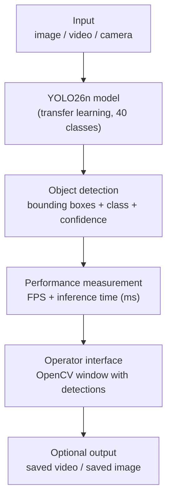
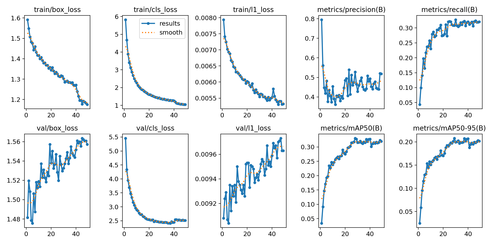
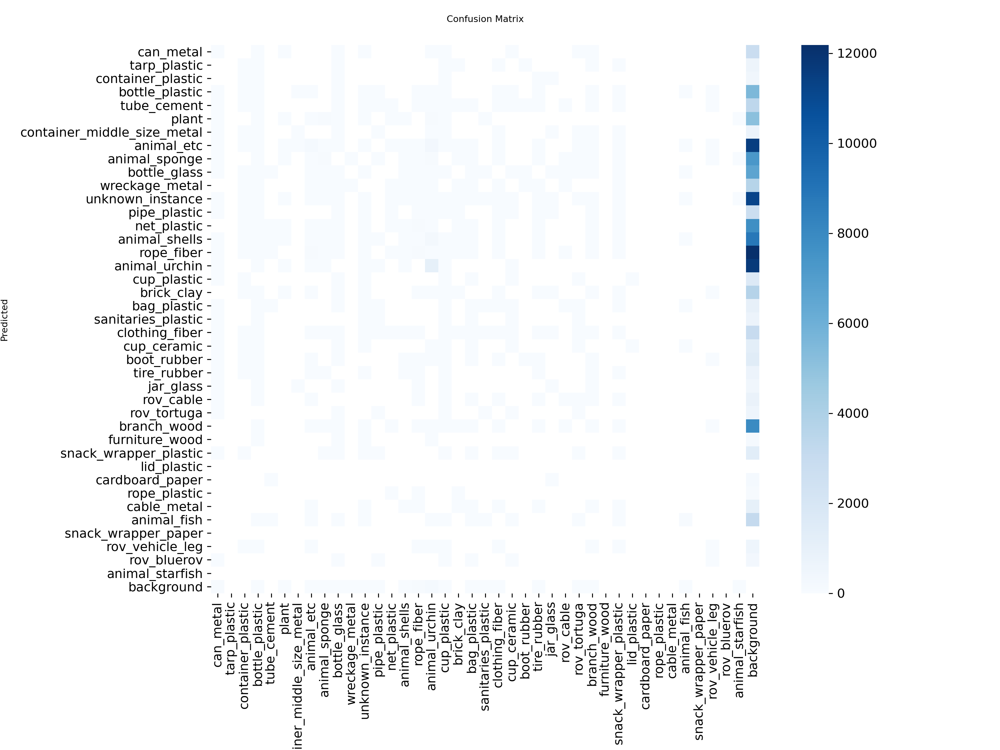

# AI-Based Underwater Visual Perception for Real-Time ROV Object Detection

A YOLO-based underwater object detection system for remotely operated vehicle (ROV) footage.
The system detects underwater objects in images and video and presents each detection to the operator as a bounding box with a class name and confidence score, together with live FPS and inference-time measurements.

---

## Overview

Underwater computer vision is considerably harder than working in air. Light is absorbed and scattered by the water itself, so colour and contrast both degrade with distance. The main problems are:

- **Turbidity** — suspended particles scatter light and produce haze, which hides distant objects and flattens contrast.
- **Low illumination** — available light falls off quickly with depth, leaving many scenes dim and colourless.
- **Colour distortion** — red is absorbed first, then green, so reds fade to grey-blue and the true colour of an object is not preserved.
- **Blur and motion** — ROV movement and currents cause motion blur and focus drift.
- **Reduced visibility** — the usable visibility range is often only a few metres, so objects appear small and partially occluded.

These effects cause many conventional detectors to fail on underwater imagery. This project uses a YOLO object detection model, adapted to underwater imagery through transfer learning, to detect the objects an ROV operator needs to see and present those detections in a simple local interface.

The system is intended for future integration with the **DUBO underwater ROV**. Live camera integration with the ROV has not yet been performed (see [Limitations](#limitations)).

---

## Key Features

- Underwater object detection using a YOLO model
- 40 object classes covering marine litter, animals, plants and ROV parts
- Transfer learning from pretrained weights
- Image file inference
- Video file inference, frame by frame
- Laptop webcam inference
- Live FPS measurement
- Inference-time measurement in milliseconds
- Operator interface with three input modes
- Cross-domain evaluation on a held-out site and camera
- Optional saving of processed video and detected images

---

## System Pipeline



---

## Dataset

The project uses the **Seaclear Marine Debris Dataset**, captured by ROVs during Seaclear field experiments at five locations.

| Property | Value |
|---|---|
| Total images | 8,610 |
| Total object instances | 31,555 |
| Classes | 40 |
| Annotation format | COCO, converted to YOLO |
| Train images | 3,574 |
| Validation images | 854 |
| Test images | 741 |
| Cross-domain test images | 3,441 |

Captured locations: Bistrina, Jakljan, Lokrum and Slano (Croatia), and Marseille (France). Images are 1920x1080 and organised by site-camera pair.

### Preparation

Annotations were converted from COCO to YOLO format (`[x, y, w, h]` absolute pixels to `[class, cx, cy, w, h]` normalised to 0–1, with class IDs remapped from 1–40 to 0–39). Image sizes were read from the annotation file rather than hardcoded.

### Splitting method

The split was **temporal block-aware**, not random. Frames were grouped into contiguous blocks of roughly 25–50 frames within each recording session, and whole blocks were assigned to one split. This prevents near-identical consecutive frames from landing on both sides of a split. Each block stays intact, so split membership respects the order in which the ROV recorded the scene.

A separate **cross-domain test set** was held out as a complete site-camera subset (Marseille / SIP-E323CV, 3,441 images). It is never used for training or model selection and is evaluated separately as a generalisation measurement.

### The dataset is not in this repository

The dataset is large (roughly 1.8 GB) and is **intentionally excluded** from Git. The repository contains the code, the trained model, and full documentation of the dataset and the split. To reproduce the training run, obtain the dataset separately and place it in the project root.

Documentation:

- [DATASET_AUDIT.md](DATASET_AUDIT.md) — full audit of the raw dataset
- [SPLIT_REPORT.md](SPLIT_REPORT.md) — splitting method, class distribution, rare-class analysis
- [dataset_summary.json](dataset_summary.json) — machine-readable summary

---

## Classes

All 40 classes, exactly as defined in the dataset configuration. No classes were renamed or invented.

| ID | Class | ID | Class |
|---|---|---|---|
| 0 | `can_metal` | 20 | `sanitaries_plastic` |
| 1 | `tarp_plastic` | 21 | `clothing_fiber` |
| 2 | `container_plastic` | 22 | `cup_ceramic` |
| 3 | `bottle_plastic` | 23 | `boot_rubber` |
| 4 | `tube_cement` | 24 | `tire_rubber` |
| 5 | `plant` | 25 | `jar_glass` |
| 6 | `container_middle_size_metal` | 26 | `rov_cable` |
| 7 | `animal_etc` | 27 | `rov_tortuga` |
| 8 | `animal_sponge` | 28 | `branch_wood` |
| 9 | `bottle_glass` | 29 | `furniture_wood` |
| 10 | `wreckage_metal` | 30 | `snack_wrapper_plastic` |
| 11 | `unknown_instance` | 31 | `lid_plastic` |
| 12 | `pipe_plastic` | 32 | `cardboard_paper` |
| 13 | `net_plastic` | 33 | `rope_plastic` |
| 14 | `animal_shells` | 34 | `cable_metal` |
| 15 | `rope_fiber` | 35 | `animal_fish` |
| 16 | `animal_urchin` | 36 | `snack_wrapper_paper` |
| 17 | `cup_plastic` | 37 | `rov_vehicle_leg` |
| 18 | `brick_clay` | 38 | `rov_bluerov` |
| 19 | `bag_plastic` | 39 | `animal_starfish` |

The model is trained to detect **only these 40 classes**. It is not a general object detector and cannot be expected to detect objects outside this list.

---

## Model

| Setting | Value |
|---|---|
| Model | YOLO26n (nano, lightweight) |
| Weights | Pretrained, then fine-tuned |
| Method | Transfer learning |
| Image size | 640 |
| Batch size | 16 |
| GPU | NVIDIA Tesla T4 |
| Training target | 50 epochs |
| Early stopping | Enabled |
| Selected weights | Best checkpoint from training |

Only the prediction head was retrained from pretrained weights, which suits a single-GPU research setup and a limited dataset.

### Training plots

| Training curves | Confusion matrix |
|---|---|
|  |  |

---

## Results

| Metric | Validation | Test | Cross-Domain |
|---|---|---|---|
| Precision | 46.4% | 30.1% | 32.1% |
| Recall | 31.1% | 24.2% | 29.3% |
| mAP50 | 32.9% | 23.1% | 26.9% |
| mAP50-95 | 20.8% | 14.6% | 17.8% |

### How to read these numbers

**The validation and test figures may be optimistic.** The normal split is temporal block-aware rather than random, which reduces but does not eliminate near-duplicate overlap between splits. A perceptual-hash analysis found roughly a third of same-subset near-duplicate image pairs still straddle the split boundary, because the ROV revisits the same seabed hundreds of frames later. Real generalisation on genuinely new footage is therefore likely lower than the validation and test numbers suggest.

**The cross-domain column is a separate measurement and must not be merged with the test column.** It comes from a completely held-out site-camera subset (Marseille / SIP-E323CV) that was never used for training or model selection. It measures how the model transfers to a different location and camera.

**The cross-domain set contains only the classes present in that subset** — 5 of the 40 classes, all of which also appear in training. So the cross-domain score measures domain shift, not unseen classes. It is not a 40-class mAP and should not be compared directly with the test column as if it were.

**These results are not perfect and the system is not production-ready.** Recall of roughly 24–31% means the model misses most of the objects it should find. Severe class imbalance means overall mAP is dominated by a handful of frequent classes. See [Limitations](#limitations).

---

## Real-Time Video Demonstration

A processing run on a full video was measured as follows:

| Property | Value |
|---|---|
| Input resolution | 1920 x 1080 |
| Input frame rate | 29.97 FPS |
| Frames processed | 1,425 |
| **Measured processing speed** | **19.56 FPS** |
| Total processing time | 72.9 seconds |

**19.56 FPS is the measured processing speed, not real-time playback.** It is below the source video's 29.97 FPS, so frames are processed slightly slower than the video plays. This should be described as near-real-time processing, not 30 FPS real-time. Achieving genuine real-time would require reducing the input resolution, lowering the confidence threshold's cost, or using a smaller model.

**The demonstration video is an external underwater ROV-style video. It is not DUBO live-camera footage.** No live integration with the DUBO ROV has been performed.

---

## Project Structure

```
.
├── README.md                    # this file
├── DATASET_AUDIT.md             # audit of the raw dataset
├── SPLIT_REPORT.md              # splitting method and class analysis
├── PROJECT_RESULTS.md           # measured results and status
├── dataset_summary.json         # machine-readable dataset summary
├── requirements.txt             # Python packages required
├── .gitignore
│
├── best.pt                      # trained model (YOLO26n, 40 classes)
├── yolo26n.pt                   # pretrained starting weights
│
├── results.png                  # training curves
├── confusion_matrix.png         # confusion matrix
│
└── scripts/
    ├── ai_vision_app.py         # operator interface (3 input modes)
    ├── realtime_detection.py    # frame-by-frame video detection
    ├── train.py                 # training script
    ├── evaluate.py              # validation metrics
    ├── check_environment.py     # environment report
    ├── create_split.py          # temporal block-aware splitting
    ├── convert_coco_to_yolo.py  # COCO -> YOLO conversion
    ├── verify_dataset.py        # dataset verification checks
    └── make_colab_package.py    # builds the GPU transfer package
```

Not in the repository, by design: the raw dataset folders (`Bistrina/`, `Jakljan/`, `Lokrum/`, `Marseille/`, `Slano/`), `dataset.json`, the generated `yolo_dataset/` and `cross_domain_test/` folders, training runs, and demo videos.

---

## Installation

```bash
git clone https://github.com/nehalarefin05/AI-Underwater-ROV-Object-Detection.git
cd AI-Underwater-ROV-Object-Detection
pip install -r requirements.txt
```

For an NVIDIA GPU, install the CUDA build of PyTorch:

```bash
pip install torch torchvision --index-url https://download.pytorch.org/whl/cu124
```

Check what was installed:

```bash
python scripts/check_environment.py
```

---

## Running the Application

The scripts expect to be run from the **project root** (the folder containing `best.pt`).

### Image / Video / Webcam Application

```bash
python scripts/ai_vision_app.py
```

A menu offers three input modes:

1. **Laptop Camera** — live feed from the default camera, continuous detection, press `Q` to stop.
2. **Video File** — enter the path to a video, processed frame by frame, with the option to save the processed video.
3. **Image File** — enter the path to an image, detect once, view the result, with the option to save it.

Every mode displays the detected class name, confidence score, number of objects, FPS, inference time in milliseconds, and the status `AI VISION ACTIVE`.

The model is set near the top of the file:

```python
MODEL_PATH = "best.pt"
CONFIDENCE = 0.25
IMGSZ = 640
DEVICE = "cpu"        # or "gpu", or "auto" to detect automatically
```

Set `DEVICE = "auto"` to use an NVIDIA GPU when one is available and fall back to CPU otherwise.

### Real-time video detection

```bash
python scripts/realtime_detection.py
```

Configure the input and output at the top of the file:

```python
MODEL_PATH = "runs/detect/runs/yolo26n_baseline/weights/best.pt"
VIDEO_PATH = "input_video.mp4"
OUTPUT_PATH = "output_detection.mp4"
```

Then run the script. It processes the video frame by frame using `stream=True` so results are not accumulated in memory, draws boxes with class and confidence, shows live FPS and inference time, and writes the processed video.

### Evaluating the trained model

```bash
python scripts/evaluate.py
```

Set `MODEL` and `DATA` at the top of `scripts/evaluate.py` to point at the trained weights and dataset YAML.

---

## Trained Model

`best.pt` in the project root is the trained YOLO26n model used for every result reported in this README. It was fine-tuned from the pretrained `yolo26n.pt` weights using transfer learning, and is the best checkpoint selected during training.

The model detects **only the 40 classes listed above**. It is not a general-purpose object detector, and it should not be expected to identify objects outside that list.

---

## Limitations

- **Severe class imbalance.** Class frequencies range from over a thousand instances to single digits. Overall mAP is dominated by the most frequent classes.
- **Rare classes have too few validation and test samples.** Several classes have single-digit examples in the evaluation splits, so their per-class metrics are unreliable. Four classes are train-only and have no meaningful validation or test score.
- **Known near-duplicate overlap in the normal split.** Roughly a third of same-subset near-duplicate pairs still cross the train/validation/test boundary. Validation and test metrics are therefore likely optimistic.
- **False positives and missed detections.** Visual inspection found both in underwater and above-water frames. Recall around 24–31% means most small or obscured objects are missed.
- **Cross-domain evaluation covers only the held-out subset's classes.** It contains 5 of the 40 classes, so it measures domain shift rather than full 40-class performance.
- **No object tracking.** Detections are per frame, so an object present across many frames is counted repeatedly.
- **Processing speed is below real time.** 19.56 FPS measured against a 29.97 FPS source.
- **DUBO live camera integration has not yet been performed.** The demonstration video is external footage, not the ROV's own camera.

---

## Future Work

- Integrate the operator interface with the DUBO ROV live camera feed.
- Add underwater image enhancement (colour restoration, dehazing, contrast correction) as a preprocessing stage.
- Optimise the model for edge deployment on the ROV's onboard computer.
- Add object tracking so an object is reported once and followed across frames.
- Extend the class set with underwater human detection if a suitable annotated dataset becomes available.

---

## Documentation

- [DATASET_AUDIT.md](DATASET_AUDIT.md) — dataset inspection: counts, classes, corruption and duplicate checks, annotation coverage
- [SPLIT_REPORT.md](SPLIT_REPORT.md) — splitting method, per-subset allocation, class distribution, rare-class analysis, cross-domain selection rationale
- [PROJECT_RESULTS.md](PROJECT_RESULTS.md) — measured training, validation, test and cross-domain results, and current project status

---

## Disclaimer

This is a **university research project**, developed for academic study and evaluation.

The reported metrics come from a single training run on one dataset and should not be presented as perfect, benchmark-grade, or production-ready performance. The external video used for the real-time demonstration is included only to **demonstrate that the inference software works** on underwater-style ROV footage. It is **not** a DUBO field-test result, and no claim is made about performance on the DUBO ROV's own camera.

The dataset used is not redistributed in this repository; refer to its original authors and terms.

---

## References

- **Seaclear Marine Debris Dataset** — ROV-captured marine litter imagery with COCO annotations, 40 categories, from Bistrina, Jakljan, Lokrum and Slano (Croatia) and Marseille (France).
- **Ultralytics YOLO** — <https://docs.ultralytics.com/>
- **PyTorch** — <https://pytorch.org/>
- **OpenCV** — <https://opencv.org/>
